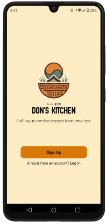
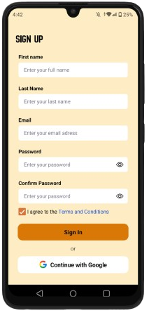

# Don's Kitchen
Don's Kitchen Mobile App.

# Features
* Interactive Menu
* Detailed Descriptions
* Customizable Orders
* Multiple Payment Methods
* Personalized Recommendations
* Dark Themed UI
* Loyalty Programs & Food Descriptions

# Course Overview
* Basic React Native Components
* Database Design using Appwrite
* User Registration & Authenticaiton
* Deployment

# Tech Stack
* React Native
* AppWrite
* HTML, CSS and JS

# Home Screen
  

# Sign Up Screen
  

# Log In Screen
  

# Walkthrough 

[Don's Kitchen Walkthrough](https://youtu.be/qv8vzBYoSQo)

In this video, the developer showcases all the files created to date. You'll get an in-depth look at key project files, including the **(auth)** and **(tabs)** folders, as well as the **index** file. Additionally, you'll see important components such as **CustomButton**, **FormField**, **BoxContainer**, **Menu**, and **Promos**. Stay tuned for a detailed overview of the project's current structure and progress.
